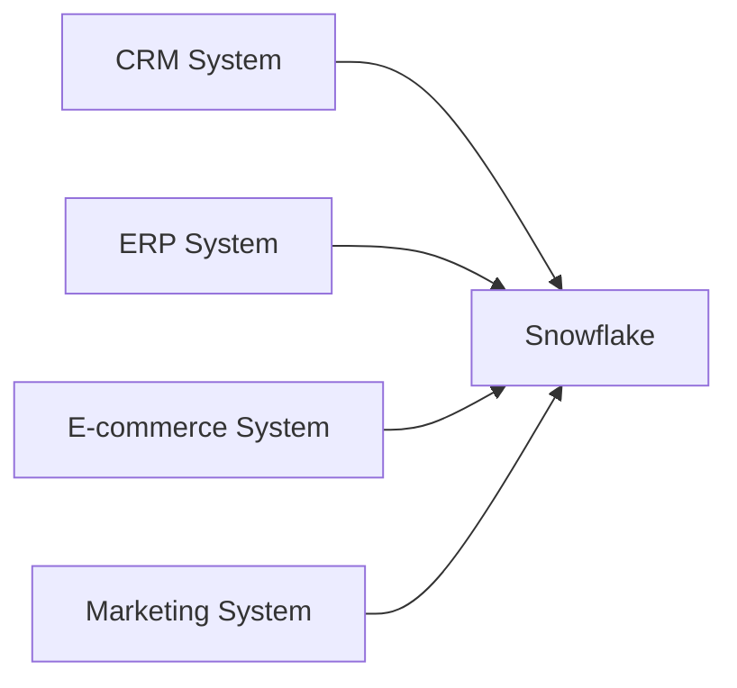

# Source Systems
"I modeled a retail company with four independent operational systems—CRM, ERP, E-commerce, and Marketing. Each system has its own data model and refresh schedule. The goal was to migrate and consolidate these systems into Snowflake using Python ingestion pipelines and dbt transformations."
## Overview

Northwind Retail Group operates several independent business systems. These systems support day-to-day operations but are not integrated, making enterprise reporting difficult.

The goal of this project is to consolidate data from these systems into a centralized Snowflake data platform.

---

## CRM System

Purpose:
Manage customer information and customer addresses.

Technology:
Microsoft SQL Server

Key Tables:
- Customers
- Addresses

Refresh Frequency:
Daily

Owner:
Sales Department

---

## ERP System

Purpose:
Manage products, inventory, and suppliers.

Technology:
Microsoft SQL Server

Key Tables:
- Products
- Inventory
- Suppliers

Refresh Frequency:
Hourly

Owner:
Operations Department

---

## E-commerce System

Purpose:
Store online orders and payment information.

Technology:
Microsoft SQL Server

Key Tables:
- Orders
- OrderItems
- Payments

Refresh Frequency:
Near Real-Time

Owner:
E-commerce Team

---

## Marketing System

Purpose:
Track marketing campaigns and customer engagement.

Technology:
REST API (simulated)

Key Tables:
- Campaigns
- EmailEvents

Refresh Frequency:
Daily

Owner:
Marketing Department

